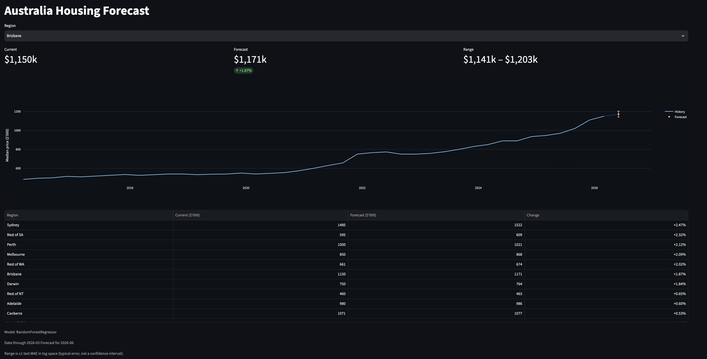

# aus_housing_forecast

Forecasts the next quarter's median house price for 15 Australian regions, using ABS median price data and the RBA cash rate.

The model is a tuned Random Forest on log returns. It beats the best naive baseline by 8%. See [Results](#results) for what that mean.

## Setup

```bash
git clone https://github.com/EddieYung2335/aus_housing_forecast
python3 -m venv venv
source venv/bin/activate
pip install -r requirements.txt
```

## Run

**[Live dashboard →](https://aus-housing-forecast.streamlit.app/)**


Download raw data (ABS dwelling values + median price, RBA cash rate) into `data/raw`:

```bash
python src/ingestion.py
```

Build cleaned quarterly panel (`data/processed/panel.parquet`):

```bash
python src/cleaning.py
```

**Ingestion skips files already cached in `data/raw`. Delete a file there to force re-download.**

Build model features (lags, rolling stats, seasonality, region dummies) into `data/processed/features.parquet`:

```bash
python src/feature.py
```

Train baselines, Random Forest, and XGBoost, tune hyperparameters via `GridSearchCV` with time-series CV folds, and evaluate on a time-based holdout split:

```bash
python src/train.py
```

Saves whichever of the two tuned models has the lower test MAE to `models/model.joblib`, and its parameters/metrics to `models/model_metadata.json`.

Predict next quarter's median price for every region:

```bash
python src/predict.py
```

Takes each region's latest feature row, predicts the next quarter's log return, and converts it back to a price. Feature columns are read from the saved model's `feature_names_in_`, so they always match what the model was trained on. Bands are ±`test_mae` applied in log space — a typical error range, not a confidence interval. Writes `data/processed/predictions.parquet`.

**`models/model.joblib` is gitignored, so run `train.py` before `predict.py` on a fresh clone.**

Launch the dashboard:

```bash
streamlit run dashboard/app.py
```

Per region: current price, forecast with its error band, and a 10-year history chart; below that, all regions ranked by forecast change. The dashboard only reads `predictions.parquet` and `features.parquet` — it loads no model and recomputes nothing, so every number on screen traces back to a `predict.py` run.

**`features.parquet` and `predictions.parquet` are checked in as a snapshot of one `train.py` + `predict.py` run, so the dashboard works on a fresh clone. Rerun both scripts to update them.**

Run the tests:

```bash
python tests/test_predict.py
```

## Results

Test MAE is measured on the **log return**, hence 0.0267 means the typical miss is about 2.7% of the price.

| Model | Test MAE | Test RMSE | Gap (test/train) |
|---|---|---|---|
| **Tuned RF (depth=4)** | **0.02671** | **0.03381** | 1.15 |
| Original RF (depth=10) | 0.02724 | 0.03424 | 1.42 |
| Tuned XGB (depth=2) | 0.02737 | 0.03449 | 1.21 |
| Roll3 mean *(baseline)* | 0.02897 | 0.03890 | — |
| Train mean *(baseline)* | 0.03033 | 0.03815 | — |
| Zero / random walk *(baseline)* | 0.03375 | 0.04246 | — |
| Persistence *(baseline)* | 0.03801 | 0.04877 | — |

The tuned Random Forest beats the best baseline by 8%. Every baseline in the table is a one-line rule that uses no machine learning, and the strongest of them (the mean of the last three quarters) is within 0.002 MAE of a model that cost a 300-combination grid search.

Quarterly house price returns are close to a random walk. Most of the variation cannot be predicted from past prices at all, so a small edge is the realistic ceiling here, not a sign that something went wrong in training. An 8% improvement over a naive rule is a modest result, which is why the full baseline table is printed above instead of a single accuracy number.

Test MAE divided by train MAE is 1.15 for the tuned model. The untuned depth-10 forest sat at 1.42, which is why the grid search settled on depth 4.

## Limitations

- Forecasts go one quarter out. The target is *t+1* and nothing beyond it, so a longer horizon would mean feeding predicted returns back in as features and letting the error compound at each step.
- The bands are +- 1 test MAE. This is a typical error size, not a confidence interval, and it carries no distributional claim, so a good share of actual outcomes will fall outside them.
- Almost every quarter in the training data comes from a long stretch of rising prices, and the Random Forest picked up that drift. It will rarely forecast a fall, and a real downturn is outside what it has seen.
- Median price moves with the mix of properties sold, not only with what an individual house is worth. A quarter with more apartment sales can pull the median down even if nothing got cheaper.
- The cash rate enters at the quarter it is observed, with no lag features. Whatever delay exists between an RBA decision and its effect on prices, the model has no way to represent it.

## Data Source

2002-03 to 2026-03, 15 regions (8 capitals + "Rest of" each state). Prices are in **$'000** (a value of `1485` means $1,485,000).

- ABS Total Value of Dwellings (`total_value_dwellings.xlsx`)
- ABS Median Price of Established House Transfers (`median_price_and_number_of_transfers.xlsx`)
- RBA Cash Rate Target (`cash_rate_target.xlsx`)

Panel merges city-level series to their state `CITY_TO_STATE` map in `src/cleaning.py`, plus cash rate, on `date`.

`src/cleaning.py` maps each city to its state with `CITY_TO_STATE`, then joins the cash rate on date. `src/feature.py` needs six quarters of history before it can compute the rolling statistics, so it drops the first six quarters of every region, which leaves 1308 rows over 90 quarters.
